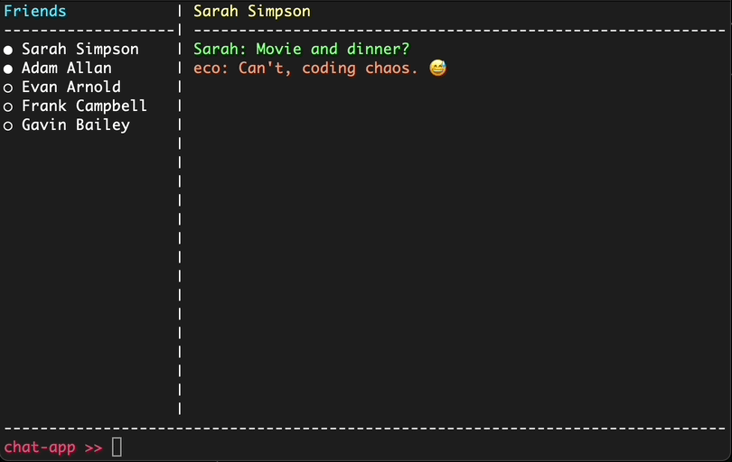
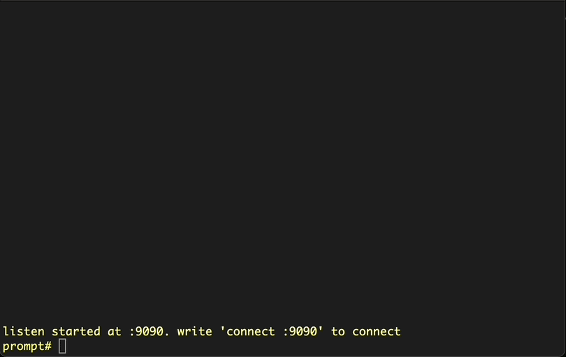
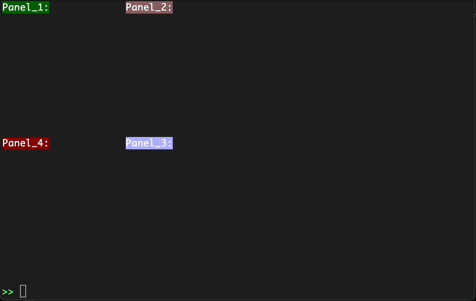
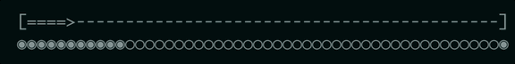

# Termium

*Easy-To-Use Command Line Interface Package*

Termium is a command line interface package that enables you to create panel-based applications with built-in command-line interaction capabilities.

## Why did I develop this?
Developed out of a personal need, Termium was born when I was working on RS232 protocol hardware and required a serial terminal program for testing. didn't like the free ones available, and wanted to make my own (which I eventually did...). Probably due to my poor googling skills, I couldn't find an easy-to-use CLI tool that exactly matched my needs. The ones I found either seemed too complex or didn't work the way I wanted them to. In my spare time, I developed this tool to meet my own requirements.

## Key Features

Termium offers a range of powerful features, including:

- Easily create output panels of any size and position.
- Customize styling for each line and title.
- Persist panels to disk with the `Dump()` function.
- Enjoy a built-in command palette for seamless interaction.
- Built-in History tool can track last commands.
- Utilize `stack` and `base` panels to adapt to your project's requirements.
- Add constant text (label) to any desired position.
- Benefit from a rune-based renderer that supports UTF-8 characters.
- Experience optimized rendering with event-based intercommunication.

For practical examples, please refer to the **/example** folder in the repository.

## Showcase

Here are a few examples of TUI apps that you can develop using Termium:

### Chat Application Interface



### TCP Application Interface



### Panels and Colors



### Progress Bars



...and much more.

## Getting Started
This section provides a straightforward guide to help you quickly get started with Termium, your versatile command-line interface package.

```go
package main

import (
	"fmt"

	"github.com/ecoshub/termium/component/config"
	"github.com/ecoshub/termium/component/panel"
	"github.com/ecoshub/termium/component/screen"
	"github.com/ecoshub/termium/utils"
)

func main() {
	// create a screen.
	s, err := screen.New()
	if err != nil {
		fmt.Println(err)
		return
	}

	// create a panel
	p := panel.NewStackPanel(&config.Config{
        // full terminal width
		Width:  utils.TerminalWith,
        // full terminal height minus command line height (1)
		Height: utils.TerminalHeight - 1,
	})

	// lets add this panel to top left corner (0,0)
	s.Add(p, 0, 0)

	// lets add a key event handler
	s.CommandPalette.ListenKeyEventEnter(func(input string) {
		// push input to panel
		p.Push(input)
	})

    // its starting the screen and blocking the main thread
	s.Start()
}
```


## Tips and Tricks

- `ESC` key is terminates the program
- Use `CTRL-A` to navigate first char of command line
- Use `CTRL-E` to navigate last char of command line
- Add desired commands to history using `s.CommandPalette.AddToHistory(input)`
- After adding input you can use **up/down** keys to switch old commands.
- Also you can clear history using `s.CommandPalette.ClearHistory()`.
- Use `s.Print(input)` and `s.AppendToLastLine(input)` to use screen without adding panels.
